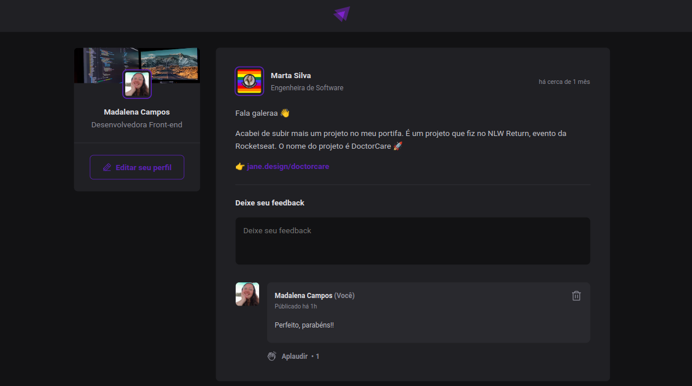

# Ignite Feed
https://img.shields.io/badge/React-20232A?style=for-the-badge&logo=react&logoColor=61DAFB

> Projeto simples para aprender principais conceitos e fazer uma breve introdução ao [🔗 React](https://pt-br.legacy.reactjs.org/docs/getting-started.html) através do curso Ignite da [🔗 Rocketseat](https://www.rocketseat.com.br/ignite).

